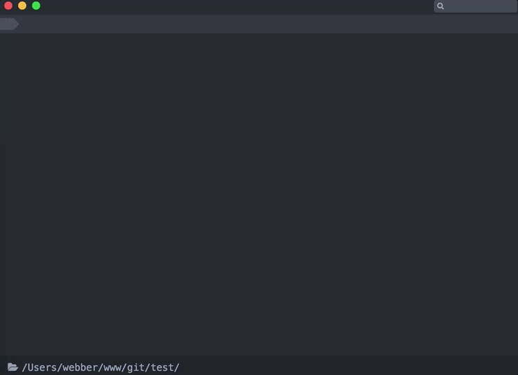

Interactive `git add` command



## Usage

```bash
$ cd ./my-git-repo
$ git-add
```

## Installing

```bash
$ npm install -g git-add-cli
```

## Requirement

**Node.js v6.0 or above**

## License

MIT
